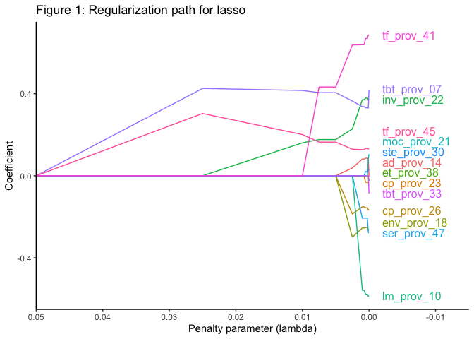

<!-- README.md is generated from README.Rmd. Please edit that file -->

# penppml

<!-- badges: start -->
<!-- badges: end -->

The `penppml` package is a set of tools that enables efficient
estimation of penalized Poisson Pseudo Maximum Likelihood (PPML)
regressions, using lasso or ridge penalties, for models that feature one
or more sets of high-dimensional fixed effects (HDFE). The methodology
is based on Breinlich, Corradi, Rocha, Ruta, Santos Silva, and Zylkin
(2021) and takes advantage of the method of alternating projections of
Gaure (2013) for dealing with HDFE, as well as the coordinate descent
algorithm of Friedman, Hastie and Tibshirani (2010) for fitting lasso
regressions. The package is also able to carry out cross-validation and
to implement the plugin lasso of Belloni, Chernozhukov, Hansen and
Kozbur (2016).

## Installation

You can install the released version of penppml from
[CRAN](https://CRAN.R-project.org) with:

``` r
install.packages("penppml")
```

And the development version from [GitHub](https://github.com/) with:

``` r
# install.packages("devtools")
devtools::install_github("diegoferrerasg/penppml")
```

## Example

This is a basic example which demonstrate how to estimate a gravity
model of international trade with three sets of HDFE using the package:

``` r
# Setup:
library(penppml)
selected <- countries$iso[countries$region %in% c("Americas")]
trade2 <- trade[(trade$exp %in% selected) & (trade$imp %in% selected), -(5:6)] 
lambdas <- c(0.05, 0.025, 0.01, 0.0075, 0.005, 0.0025, 0.001, 0.00075, 0.0005, 0.00025, 0.0001, 0)
```

``` r
# Main command:
reg <- mlfitppml(data = trade2,
                 dep = "export",
                 fixed = list(c("exp", "time"), 
                              c("imp", "time"),
                              c("exp", "imp")),
                 penalty = "lasso",
                 lambdas = lambdas)
```

We can plot the resulting regularization path as follows:



For more examples and details on how to use the package, see the
vignette.

## References

Breinlich, H., Corradi, V., Rocha, N., Ruta, M., Santos Silva, J.M.C.
and T. Zylkin, T. (2021). “Machine Learning in International Trade
Research: Evaluating the Impact of Trade Agreements”, Policy Research
Working Paper; No. 9629. World Bank, Washington, DC.

Correia, S., P. Guimaraes and T. Zylkin (2020). “Fast Poisson estimation
with high dimensional fixed effects”, *STATA Journal*, 20, 90-115.

Gaure, S (2013). “OLS with multiple high dimensional category
variables”, *Computational Statistics & Data Analysis*, 66, 8-18.

Friedman, J., T. Hastie, and R. Tibshirani (2010). “Regularization paths
for generalized linear models via coordinate descent”, *Journal of
Statistical Software*, 33, 1-22.

Belloni, A., V. Chernozhukov, C. Hansen and D. Kozbur (2016). “Inference
in high dimensional panel models with an application to gun control”,
*Journal of Business & Economic Statistics*, 34, 590-605.
